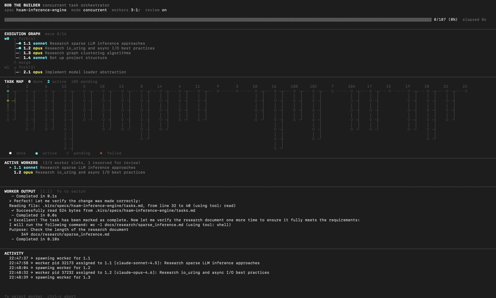

# Bob the Builder

Parallel task runner for [Kiro](https://kiro.dev) specs. Point it at a spec, and it figures out what depends on what, spins up isolated git worktrees, and runs tasks concurrently with AI agents.



## Quick Start

```bash
git clone https://github.com/joshuakatt/Bob-The-Builder.git
cd your-project # the project where your spec lives
path/to/Bob-The-Builder/setup.sh      # one-time: validates prereqs, installs agent configs
path/to/Bob-The-Builder/btb.sh spec-name
```

That's it. btb lives in its own directory and operates on whatever repo you `cd` into.

## Model Configuration

btb lets you control which AI models run your tasks. All settings live in `config.sh` and can be overridden with environment variables.

**Pick your models:**

```sh
# Models the planner can assign (cheapest → most capable)
AVAILABLE_MODELS="claude-sonnet-4.5,claude-opus-4.6"

# Fallback when the planner doesn't assign one
DEFAULT_TASK_MODEL="claude-opus-4.6"
```

The planner automatically picks a model per task based on complexity — simple tasks get the cheaper model, complex ones get the more capable one.

**Override for specific roles:**

```sh
STEERING_MODEL="claude-opus-4.6"    # generates project context docs
REVIEWER_MODEL="claude-opus-4.6"    # runs the review gate
```

**Quick overrides via env vars** (no need to edit `config.sh`):

```sh
# Use sonnet for everything
DEFAULT_TASK_MODEL=claude-sonnet-4.5 REVIEWER_MODEL=claude-sonnet-4.5 ./btb.sh spec-name

# Or export for the session
export DEFAULT_TASK_MODEL=claude-sonnet-4.5
./btb.sh spec-name
```

## Prerequisites

| Dependency | Notes                                                                                                      |
| ---------- | ---------------------------------------------------------------------------------------------------------- |
| bash 3.2+  | macOS default works. Windows: use [WSL](https://learn.microsoft.com/en-us/windows/wsl/install) or Git Bash |
| kiro-cli   | Installed and authenticated                                                                                |
| git        | Any recent version                                                                                         |
| python3    | Used for DAG analysis                                                                                      |
| perl       | Optional — TUI keyboard input. Use `--no-tui` without it                                                   |

Run `setup.sh` once in your target repo to validate everything and install agent configs.

> **Windows:** btb is a bash tool. Run it inside WSL or Git Bash — not PowerShell or cmd.

## Usage

```sh
btb.sh spec-name                     # run a spec (looks in .kiro/specs/<name>/)
btb.sh --spec-dir path/to/spec       # explicit path to spec directory
btb.sh spec-name --sequential        # one task at a time, no DAG
btb.sh spec-name --dry-run           # analyze DAG only, don't execute
btb.sh spec-name --no-review         # skip the review gate
btb.sh spec-name --no-tui            # plain log output instead of TUI
btb.sh spec-name --max-parallel 6    # set max concurrent workers
btb.sh --cleanup                     # remove all worktrees, branches, and locks
```

## Spec Structure

Your spec directory needs at minimum a `tasks.md`. The planner also reads `design.md` and `requirements.md` if present.

```
.kiro/specs/spec-name/
├── tasks.md          # required — task list with checkboxes
├── design.md         # recommended — architecture and implementation guidance
└── requirements.md   # recommended — acceptance criteria
```

Tasks in `tasks.md` use this format:

```markdown
- [ ] 1. Set up project infrastructure
  - [ ] 1.1 Initialize project with TypeScript config
  - [ ] 1.2 Set up database schema
- [ ] 2. Implement core features
  - [ ] 2.1 Build the API layer
  - [ ] 2.2 Add authentication
```

The planner analyzes dependencies between tasks and groups them into waves for parallel execution. Subtasks (1.1, 1.2, etc.) are the units of work — parent tasks auto-complete when all their subtasks finish.

## How It Works

1. **Analysis** — The planner reads your tasks and design docs, builds a dependency DAG, and assigns models per task
2. **Execution** — Tasks spawn as workers in isolated git worktrees. A task becomes ready once all its dependencies are synced to main
3. **Sync** — Completed tasks merge back to main immediately (serialized by lock). Merge conflicts are resolved by a dedicated resolver agent
4. **Review** — After a batch of tasks sync, the reviewer audits the work. If issues are found, a fix agent addresses them
5. **Completion** — Parent tasks auto-complete when all subtasks finish. The run ends when all tasks are resolved

## Configuration

All settings live in `config.sh`. Most can be overridden via environment variables.

### Concurrency

| Setting                   | Default | Description                                           |
| ------------------------- | ------- | ----------------------------------------------------- |
| `MAX_PARALLEL`            | `6`     | Total concurrent agent processes (workers + reviewer) |
| `REVIEW_RESERVED_SLOTS`   | `1`     | Slots reserved for the reviewer agent                 |
| `MAX_ITERATIONS_PER_TASK` | `20`    | Max agent iterations per task before giving up        |

Effective worker slots = `MAX_PARALLEL` - `REVIEW_RESERVED_SLOTS`. With defaults, that's 5 workers + 1 reviewer.

### Models

| Setting              | Default                             | Description                                  |
| -------------------- | ----------------------------------- | -------------------------------------------- |
| `AVAILABLE_MODELS`   | `claude-sonnet-4.5,claude-opus-4.6` | Models the planner can assign to tasks       |
| `DEFAULT_TASK_MODEL` | `claude-opus-4.6`                   | Fallback when planner doesn't assign a model |
| `STEERING_MODEL`     | `claude-opus-4.6`                   | Model used to generate steering docs         |
| `REVIEWER_MODEL`     | `claude-opus-4.6`                   | Model used for the review gate               |

The planner picks a model per task based on complexity. Simple tasks get cheaper models, complex ones get more capable models.

### Review Gate

| Setting              | Default | Description                                       |
| -------------------- | ------- | ------------------------------------------------- |
| `ENABLE_REVIEW`      | `true`  | Master switch for post-batch quality review       |
| `REVIEW_BATCH_SIZE`  | `3`     | Number of synced tasks before triggering a review |
| `MAX_REVIEW_RETRIES` | `2`     | Review→fix cycles before accepting                |

The reviewer audits completed work against the spec after every batch of synced tasks. If it finds issues, the player agent gets a fix attempt. Use `--no-review` to skip entirely.

### Retry and Safety

| Setting                   | Default | Description                                   |
| ------------------------- | ------- | --------------------------------------------- |
| `MAX_RETRIES`             | `10`    | Retries per task on failure                   |
| `MAX_DAG_REPAIR_ATTEMPTS` | `3`     | Planner re-prompts to patch missing DAG tasks |
| `STALE_THRESHOLD`         | `600`   | Seconds of inactivity before killing a worker |
| `RATE_LIMIT_PAUSE`        | `3`     | Seconds between spawning workers              |

The stale threshold is activity-based, not wall-clock. A worker is considered active if its log file is growing, it has descendant processes running anywhere in its process tree (e.g. a long build or test suite), or the process is alive.

### Shared Build Cache

| Setting                  | Default                 | Description                                          |
| ------------------------ | ----------------------- | ---------------------------------------------------- |
| `SHARED_BUILD_CACHE_DIR` | `../.ralph-build-cache` | Shared build artifact directory across all worktrees |

Parallel worktrees normally duplicate build artifacts (Rust `target/`, Go cache, Gradle home, etc.). The shared cache redirects these via environment variables (`CARGO_TARGET_DIR`, `GRADLE_USER_HOME`, `GOPATH`/`GOCACHE`, `PIP_CACHE_DIR`). Set to empty string to disable.

## Steering Docs

On first run, if your repo doesn't have `.kiro/steering/` docs, they're auto-generated from your spec and codebase. These give all agents persistent project context — architecture decisions, conventions, tech stack, etc.

If you already have steering docs, they're used as-is.

## Logs

All logs go to `.ralph-logs/` in your repo:

- `debug_<timestamp>.log` — orchestrator debug log
- `task_<id>_<timestamp>.log` — per-task agent output
- `dag_<timestamp>.json` — the dependency DAG produced by the planner
- `dag_validation_<timestamp>.log` — diagnostic info when DAG validation fails
- `steering_<timestamp>.log` — steering doc generation output

## DAG Validation

For large specs (100+ tasks), the planner might miss some tasks. btb handles this automatically:

1. Compares DAG task count against incomplete tasks in `tasks.md`
2. If tasks are missing → asks the planner to produce a patch for only the missing ones
3. Repeats up to `MAX_DAG_REPAIR_ATTEMPTS` times (default: 3)
4. Any remaining stragglers get appended as sequential waves — no task is ever lost

You can also validate manually:

```sh
./validate-dag.sh spec-name
./validate-dag.sh spec-name .ralph-logs/dag_20250208_143022.json
```

If you still see issues, try `--sequential` mode (bypasses DAG entirely), break large specs into smaller ones, or check `.ralph-logs/dag_*.json` to see what the planner understood.

## Cloud Deployment

The `deploy/` directory has everything you need to run btb as a service on a Linux server. It includes a webhook server that listens for GitHub push events and automatically runs btb on branches containing a `.btb` config file.

### Quick setup

1. Provision a fresh Amazon Linux 2023 or Ubuntu instance:

   ```sh
   sudo bash deploy/provision.sh
   ```

2. Copy the btb code to `/opt/btb` on the instance

3. Edit `/etc/btb-service/config.env` with your webhook secret, GitHub token, TLS certs, and paths (see `deploy/config.env.example` for all options)

4. Set up the GitHub webhook:

   ```sh
   bash deploy/setup-webhook.sh
   ```

5. Start the service:
   ```sh
   sudo systemctl start btb-service
   ```

The service exposes a dashboard at `https://<your-host>:8443/` showing job status, queue, and logs.

### What's in `deploy/`

| File                  | Purpose                                              |
| --------------------- | ---------------------------------------------------- |
| `provision.sh`        | Installs all dependencies on a fresh instance        |
| `btb-service.service` | systemd unit file (auto-restart, security hardening) |
| `config.env.example`  | Annotated config template                            |
| `setup-webhook.sh`    | Creates the GitHub webhook via API                   |

## Cleanup

If a run is interrupted or you need to reset:

```sh
./btb.sh --cleanup
```

This removes all worktrees, ralph branches, and lock files.

## License

[MIT](LICENSE)
